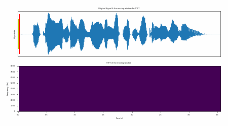

# Spectogram
## اسپکتوگرام یا طیف نگار چیست؟
### در صدا و صحبت
#### من یه نردم

---
class: text-center

---

### موج صدا چطوریه؟
 

 
<v-click>

</v-click>
<v-switch>
  <template #1> 
  به صورت باز شده یک موج سینوسی هستش
  
</template>
  <template #2> 
  وقتی اینا رو بهم میچسبدن تبدیل میشن به یه شکل موج طور
  

  </template>
  
</v-switch>

---

# مشکلات موج سینوسی

<v-clicks>

- تداخل فرکانس‌ها
- وضوح پایین در فرکانس‌های بالا
- محدودیت‌های نمایش بصری
- یچیدگی تحلیل

</v-clicks>
 
 

<v-click>

## مزایا

<v-clicks>

- انرژی

- قابلیت تشخیص الگوه

</v-clicks>

</v-click>

---

# اسپکتوگرام

 
<v-clicks>

- **تحلیل صدا**: شناسایی الگوها و تغییرات در زمان.
- **موسیقی**: تجسم نت‌های موسیقی و هارمونیک‌های آن.
- **شناسایی گفتار**: درک آواشناسی به صورت بصری.
- **زیست‌صدا**: مطالعه آوای جانوران.
- **مهندسی صوتی**: طراحی فیلترها و بهبود کیفیت صدا.

</v-clicks>

---

# تاریخچه کوتاهی از اسپکتروگرام‌ها

<v-clicks>

- اولین استفاده‌ها به دهه ۱۹۴۰ برمی‌گردد.
- توسعه با پیشرفت تکنولوژی سیگنال‌های دیجیتال در دهه‌های بعد.

</v-clicks>

----

# مراحل ساخت اسپکتروگرام

<v-clicks>

1. **دریافت سیگنال**: ضبط یا بارگذاری سیگنال صوتی.
2. **پنجره‌بندی**: اعمال تابع پنجره بر قسمت‌های کوچک سیگنال برای کاهش اثرات لبه.
3. **تبدیل فوریه**: تبدیل هر قسمت پنجره‌بندی شده به حوزه فرکانس.
4. **نمایش**: رسم نتایج در تصویر دو بعدی.

</v-clicks>

---

# دریافت یا بارگذاری سیگنال صوتی

<v-clicks depth=2>

- **ضبط یا بارگذاری**: ابتدا باید سیگنال صوتی را به صورت دیجیتال داشته باشید.
- **نرخ نمونه‌برداری (Sample Rate)**: شناخت نرخ نمونه‌برداری برای تحلیل فرکانس‌ها ضروری است.
    - تعیین‌کننده بالاترین فرکانس قابل تشخیص (Nyquist Frequency = ۱/۲ نرخ نمونه‌برداری).
    - برای تحلیل دقیق فرکانس‌ها، نرخ نمونه‌برداری باید حداقل دو برابر بالاترین فرکانس مورد علاقه باشد.
</v-clicks>

----

# پنجره‌بندی سیگنال

<v-clicks>

- **تقسیم به فریم‌ها**: سیگنال به قطعات کوچک‌تر به نام فریم تقسیم می‌شود.
- **انواع پنجره**: هانینگ، همینگ، کایزر و غیره برای کاهش نشت طیفی.
- **اندازه پنجره**: تاثیر بر وضوح زمانی و فرکانسی.

</v-clicks>

---

# انواع پنجره‌ها
 **پنجره هانینگ (Hanning)**:

<v-clicks>

  - شکل: یک نیم‌دایره که به صفر در دو انتها می‌رسد.
  - کاربرد: کاهش نشت طیفی، وضوح بهتر در فرکانس‌های کم.
  

</v-clicks>
---

# انواع پنجره‌ها
**پنجره همینگ (Hamming)**:

<v-clicks>
  
  - شکل: مشابه هانینگ اما با مقدار صفر نمی‌شود.
  - کاربرد: کمینه کردن نشت طیفی در حالی که وضوح فرکانسی حفظ شود.
   
</v-clicks>

---

# انواع پنجره‌ها

<v-clicks>

- **پنجره کایزر (Kaiser)**:
  - شکل: انعطاف‌پذیر با پارامتر بتا (β) که می‌تواند برای کمینه کردن نشت طیفی تنظیم شود.
  - کاربرد: زمانی که کنترل دقیق‌تر بر نشت طیفی و وضوح نیاز است.

- **پنجره مستطیلی (Rectangular)**:
  - شکل: هیچ تغییری در دامنه نمی‌دهد، ساده‌ترین فرم پنجره.
  - کاربرد: زمانی که نشت طیفی مشکلی ندارد یا در تحلیل‌های ساده.

- **پنجره‌های دیگر**: بلکمن (Blackman), فلت‌تاپ (Flat-top) و غیره با استفاده‌های خاص خود.

</v-clicks>
---

# چطور این پنجره ها اعمال میشن
 

---

# تبدیل فوریه

- **درک فرکانس‌ها**: به ما اجازه می‌دهد فرکانس‌های موجود در سیگنال را تجزیه و تحلیل کنیم.
- **تحلیل طیفی**: فراهم کردن اطلاعات دقیق درباره دامنه و فاز هر فرکانس.

---

# تبدیل فوریه زمان-کوتاه (STFT)
<v-clicks>

### ۱. **پنجره‌بندی سیگنال**
- سیگنال به قطعات کوچک‌تر (فریم‌ها) تقسیم می‌شود.
- هر فریم با یک پنجره (مثل هانینگ، همینگ) ضرب می‌شود.

### ۲. **اعمال تبدیل فوریه سریع (FFT)**
- هر فریم پنجره‌بندی شده به حوزه فرکانس تبدیل می‌شود.
- FFT نسخه سریع‌تر تبدیل فوریه برای محاسبات کامپیوتری است.

### ۳. **استخراج داده‌ها**
- برای هر فریم، طیف فرکانسی (مجموعه‌ای از دامنه‌ها برای هر فرکانس) بدست می‌آید.
- معمولاً فقط دامنه‌ها (شدت فرکانس‌ها) برای اسپکتروگرام استفاده می‌شود.

</v-clicks>

---

# فوت آخر

## مقاید تبدیل فوریه زمان کوتاه رو به توان دو میرسونیم تا اسپکتورام یا طیف نگار رو بهمون بده
---

--- 